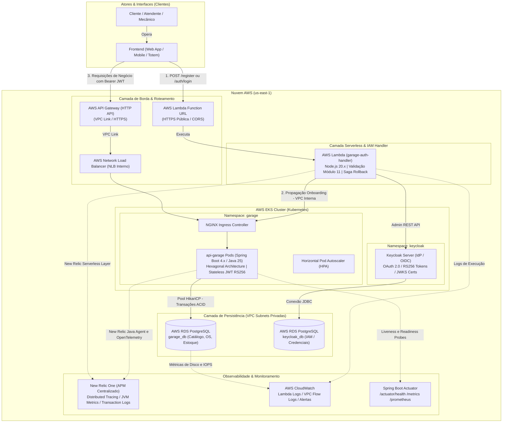

# 🚗 Garage API (`15-soat-tech-challenge-garage`)

Microsserviço central do Tech Challenge (FIAP SOAT) responsável pela gestão e automação do fluxo operacional de oficinas mecânicas, incluindo cadastro de clientes, veículos, controle de peças/inventário, funcionários e ciclo de vida de ordens de serviço.

---

## 🎯 1. Descrição do Propósito

A **Garage API** implementa as regras de negócio essenciais de uma oficina mecânica moderna sob o padrão de **Arquitetura Hexagonal (Ports & Adapters)** e **Domain-Driven Design (DDD)**. 

Principais responsabilidades:
* **Gestão de Clientes e Veículos**: Cadastro, busca por CPF/CNPJ e associação de veículos a proprietários.
* **Ordens de Serviço (Work Orders)**: Abertura, diagnóstico, aprovação de orçamentos, execução de serviços e finalização com pagamento.
* **Inventário e Serviços**: Controle de estoque de peças, precificação e catálogo de serviços mecânicos.
* **Segurança e Controle de Acesso (RBAC)**: Proteção de rotas sensíveis com Spring Security 7 e tokens JWT (diferenciando perfis `CUSTOMER` e `EMPLOYEE`).

---

## 💻 2. Tecnologias Utilizadas

* **Linguagem & Runtime**: Java 25 (OpenJDK / Eclipse Temurin).
* **Framework Principal**: Spring Boot 4.x (Spring Web, Spring Data JPA, Spring Security, Spring Validation, Spring Actuator).
* **Banco de Dados**: PostgreSQL 15 (com migrações automatizadas via Flyway).
* **Segurança**: Criptografia BCrypt, autenticação Stateless via JWT (JSON Web Tokens) e controle de acesso RBAC.
* **Gerenciador de Dependências & Build**: Apache Maven 3.9+.
* **Qualidade & Testes**: JUnit 5, Mockito, Testcontainers, Jacoco (cobertura de código) e SonarQube / SonarCloud.
* **Segurança de Dependências**: OWASP Dependency-Check.
* **Documentação de API**: OpenAPI 3 / SpringDoc Swagger UI.
* **Conteinerização & Deploy**: Docker (multi-stage build), Docker Compose e Helm Charts para Kubernetes (AWS EKS).

---

## 🏛️ 3. Diagrama de Componentes da Arquitetura

O diagrama a seguir apresenta a **Visão de Componentes em Nuvem (AWS)**, detalhando o ecossistema de microsserviços, roteamento de APIs, provedor de identidade, persistência de dados relacional e a esteira de observabilidade/monitoramento:



### 🧩 Descrição dos Componentes:

1. **Atores e Interfaces**:
   - Clientes, atendentes e mecânicos interagem com as aplicações frontend (Web/Mobile/Totem).
2. **Camada de Borda e Roteamento (*Edge & Ingress*)**:
   - **AWS Lambda Function URL**: Endpoint HTTPS público com suporte a CORS dedicado para operações de identidade (`POST /register`, `POST /auth/login` e `GET /users/{cpf}`).
   - **AWS API Gateway (HTTP API) + VPC Link**: Ponto de entrada gerenciado para as requisições de negócio autenticadas com Bearer JWT, roteando com segurança via VPC Link diretamente para o Network Load Balancer (NLB) interno do cluster EKS.
3. **Camada Serverless & IAM (*Identity & Access Management*)**:
   - **AWS Lambda (`garage-auth-handler`)**: Função serverless em Node.js responsável por validar documentos brasileiros (Módulo 11 da Receita Federal) e orquestrar o onboarding com o padrão Saga (Keycloak + API da oficina com rollback automático).
   - **Keycloak (IdP / OIDC)**: Servidor de identidade corporativo provisionado no Kubernetes, emitindo tokens JWT assinados assimetricamente com algoritmo RS256 e expondo endpoint JWKS (`/certs`).
4. **Camada de Negócio e Computação (*Kubernetes / EKS*)**:
   - **`api-garage`**: Microsserviço central construído em Spring Boot 4.x e Java 25 sob os preceitos de Clean Architecture e DDD. Executa a validação **stateless de tokens JWT 100% localmente em memória** (via chaves públicas do JWKS cacheadas, sem chamadas de rede ao Keycloak a cada requisição) e escala horizontalmente via HPA (Horizontal Pod Autoscaler).
5. **Camada de Persistência de Dados (*AWS RDS PostgreSQL*)**:
   - Hospedada em subnets privadas sem acesso público à internet.
   - Instância `garage_db` dedicada às tabelas de ordens de serviço, clientes, veículos, estoque e serviços; instância `keycloak_db` dedicada às credenciais de identidade.
6. **Camada de Observabilidade e Confiabilidade (*SRE / APM*)**:
   - **New Relic One**: Monitoramento de telemetria completa (Distributed Tracing, tempo de resposta de endpoints, Throughput, métricas de JVM, Garbage Collection e logs unificados).
   - **Spring Boot Actuator**: Fornece os endpoints `/actuator/health` consumidos pelos Probes do Kubernetes (`livenessProbe` e `readinessProbe`) e `/actuator/prometheus` para métricas de microsserviço.
   - **AWS CloudWatch**: Armazena logs de execução da função Lambda, métricas de hardware do RDS e alarmes de infraestrutura.

---

## ⚙️ 4. Passos para Execução e Deploy

> [!CAUTION]
> **DIRETRIZ MANDATÓRIA DE DEVSECOPS: NUNCA MAPEAR DADOS SENSÍVEIS NO CÓDIGO FONTE**
> É **estritamente proibido** comitar senhas, tokens de API, chaves secretas ou credenciais em arquivos de código fonte, arquivos de propriedades (`application.properties`, `.yaml`), manifests Helm ou scripts.
> Todos os valores sensíveis (senhas de banco, credenciais AWS, chaves do New Relic) **devem ser configurados exclusivamente nos Segredos da Pipeline (GitHub Actions Secrets)** e consumidos via variáveis de ambiente injetadas em tempo de execução.

### 4.1. Execução Local com Docker Compose

Para subir a aplicação rapidamente junto com o banco PostgreSQL local:

```bash
# 1. Compilar o projeto sem rodar testes
mvn clean package -DskipTests

# 2. Iniciar os contêineres da aplicação e banco
docker compose up -d

# 3. Acompanhar os logs
docker compose logs -f api
```

### 4.2. Execução Local via Maven
```bash
# Exportar variáveis de banco se necessário
export SPRING_DATASOURCE_URL="jdbc:postgresql://localhost:5432/garage_db"
export SPRING_DATASOURCE_USERNAME="postgres"
export SPRING_DATASOURCE_PASSWORD="password"

# Executar a aplicação
mvn spring-boot:run -pl application
```

### 4.3. Deploy no Kubernetes (AWS EKS) via Helm
Com o `kubectl` conectado ao cluster AWS EKS (`techchallenge-cluster`):

```bash
helm upgrade --install api-garage helm \
  --namespace garage \
  --set image.repository=890958457263.dkr.ecr.us-east-1.amazonaws.com/garage-api \
  --set image.tag=latest \
  --wait --timeout 3m
```

### 4.4. Deploy Automatizado (CI/CD via GitHub Actions)
O repositório conta com pipeline automatizada em `.github/workflows/pipeline.yml` (disparada exclusivamente na branch `master`):
1. **Quality Assurance**: Execução de testes unitários e cobertura com Jacoco.
2. **Security**: Varredura de vulnerabilidades OWASP.
3. **Build Image**: Geração da imagem Docker e push para o **AWS ECR** (`garage-api`).
4. **Deploy**: Instalação e atualização automática no **AWS EKS** via Helm.

---

## 📑 5. Link para o Swagger e Postman das APIs

### 🌐 Swagger UI / OpenAPI 3:
* **Execução Local**: [http://localhost:8080/api/swagger-ui/index.html](http://localhost:8080/api/swagger-ui/index.html)
* **Especificação OpenAPI JSON (Local)**: [http://localhost:8080/api/v3/api-docs](http://localhost:8080/api/v3/api-docs)
* **Ambiente AWS (via AWS API Gateway)**:
  ```
  https://igqc9vtfx9.execute-api.us-east-1.amazonaws.com/api/swagger-ui/index.html
  ```
* **OpenAPI JSON na AWS**:
  ```
  https://igqc9vtfx9.execute-api.us-east-1.amazonaws.com/api/v3/api-docs
  ```

### 📬 Coleção Postman / cURL de Exemplo:
Para importar no Postman ou testar no terminal:

```bash
# 1. Health Check
curl --location 'https://igqc9vtfx9.execute-api.us-east-1.amazonaws.com/api/actuator/health'

# 2. Cadastro de Cliente (Autenticado com Token Bearer)
curl --location 'https://igqc9vtfx9.execute-api.us-east-1.amazonaws.com/api/v1/customers' \
--header 'Content-Type: application/json' \
--header 'Authorization: Bearer <SEU_TOKEN_JWT>' \
--data-raw '{
    "name": "Maria Oliveira",
    "document": "529.982.247-25",
    "email": "maria@email.com",
    "phone": "11999999999"
}'

# 3. Consulta de Ordem de Serviço
curl --location 'https://igqc9vtfx9.execute-api.us-east-1.amazonaws.com/api/v1/orders' \
--header 'Authorization: Bearer <SEU_TOKEN_JWT>'
```

---

## 🏛️ 6. Governança e Documentação Arquitetural

* **[Catálogo de ADRs (Architecture Decision Records)](docs/adr/README.md)**: 8 registros formais de decisões arquiteturais já aceitas e implementadas (PostgreSQL, Saga Pattern, Identidade Unificada, RS256/JWKS, Clean Architecture, Módulo 11, Testcontainers e IaC segregado).
* **[Catálogo de RFCs (Requests for Comments)](docs/rfc/README.md)**: 5 propostas formais para evolução futura da arquitetura (EDA com SQS/SNS, Transactional Outbox, Gateway Pix, Cache Redis e GraalVM Native Image).
* **[Diagramas de Sequência da Fase 3](docs/phase3/)**: Especificação detalhada dos fluxos de negócio com diagramas Mermaid revisados (Onboarding de Funcionários, Clientes, Veículos, Ordens de Serviço e Pagamento).
