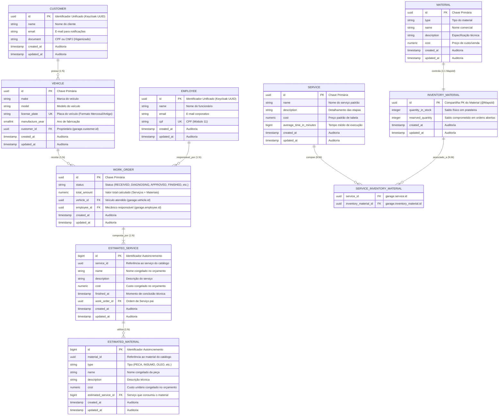

# ADR 0001: Justificativa Formal da Escolha do Banco de Dados Relacional (PostgreSQL) e Modelo de Entidade-Relacionamento (ER)

* **Status**: Aceito (Accepted)
* **Data**: 2026-09-10
* **Autores**: Tech Challenge Garage Architecture Guild
* **Decisores Técnicos**: Especialistas em Arquitetura de Software e Engenharia de Dados

---

## 1. Contexto e Declaração do Problema

O sistema `api-garage` gerencia o núcleo operacional, técnico e financeiro de uma oficina mecânica. O domínio envolve:
* Rastreabilidade estrita de Ordens de Serviço (OS) com transições de status (Recebida, Em Diagnóstico, Aguardando Aprovação, Aprovada, Em Execução, Finalizada, Cancelada);
* Vínculo inquebrável entre veículos e seus respectivos clientes proprietários;
* Reserva e baixa física de peças e insumos no inventário de estoque;
* Faturamento de mão de obra e materiais com precisão contábil e auditoria de alterações.

O time de engenharia precisava decidir formalmente a tecnologia de persistência de dados (Banco Relacional vs Não-Relacional/NoSQL) e estruturar o modelo relacional para garantir consistência transacional, integridade referencial e alta performance sob concorrência.

---

## 2. Decisão Arquitetural: Escolha do PostgreSQL

Decidiu-se pela adoção do **PostgreSQL (versão 16+ gerenciado via AWS RDS com Multi-AZ)** como sistema de gerenciamento de banco de dados relacional principal da oficina.

### Justificativas Técnicas e de Negócio:

1. **Garantias ACID Estritas (Atomicidade, Consistência, Isolamento e Durabilidade)**:
   - Operações como a finalização de uma ordem de serviço exigem atualizar o status da OS, registrar os serviços executados, abater materiais do inventário e disparar a cobrança. A capacidade de executar essas mutações sob isolamento transacional forte (*Read Committed* / *Repeatable Read*) é mandatória para impedir que peças fiquem com saldo negativo ou ordens de serviço fiquem sem mecânico atribuído.
2. **Precisão Numérica Arbitrária (`NUMERIC` / `BigDecimal`)**:
   - Cálculos financeiros de orçamentos, custos de peças e taxas não podem sofrer com arredondamentos imprecisos de ponto flutuante binário (típicos de engines baseadas em IEEE 754). O tipo `NUMERIC(15,2)` do PostgreSQL assegura exatidão centesimal contábil.
3. **Suporte Nativo a Identificadores Universais (`UUID`)**:
   - O PostgreSQL armazena UUIDs de forma otimizada em 128 bits nativos binários (em vez de strings de 36 caracteres), ocupando menos espaço em disco e permitindo indexação B-Tree ultraeficiente em chaves primárias e estrangeiras.
4. **Capacidades Híbridas e Poliglotas (Relacional + JSONB)**:
   - Embora relacional, o PostgreSQL oferece suporte avançado a colunas `JSONB` indexadas com GIN, permitindo armazenar payloads flexíveis de auditoria e configurações sem abrir mão das constraints relacionais.
5. **Maturidade e Ecossistema Enterprise**:
   - Compatibilidade de primeira classe com Spring Data JPA, Hibernate 6 e Flyway/Liquibase;
   - Suporte perfeito a **Testcontainers** para testes de integração fiéis ao ambiente de produção (eliminando o uso de simuladores em memória como H2);
   - Recursos gerenciados na AWS: criptografia em repouso com AWS KMS, backups automáticos Point-In-Time Recovery (PITR) e Read Replicas para separação de relatórios.

---

## 3. Ajustes e Refinamentos no Modelo Relacional

Durante a evolução da arquitetura, realizamos ajustes estruturais de alto impacto no esquema `garage`:

### 3.1. Eliminação da Tabela Duplicada de Usuários (`users` / `usuarios`)
* **Antes**: Havia o risco de manter tabelas de usuários locais para autenticação.
* **Ajuste**: A governança de credenciais, senhas e tokens foi segregada exclusivamente para o Keycloak (IAM). A `api-garage` mantém apenas as entidades de negócio puras: `Employee` (mecânicos/atendentes) e `Customer` (clientes).

### 3.2. Padrão de Identidade Unificada (Keycloak UUID como PK)
* **Ajuste**: As tabelas `garage.employee` e `garage.customer` adotaram o próprio UUID gerado pelo Keycloak como sua Chave Primária (`id UUID PRIMARY KEY`), eliminando tabelas de mapeamento "de-para" e reduzindo o número de JOINs em consultas autenticadas (ver [ADR 0003](file:///c:/git/fiap/15-soat-tech-challenge-garage/docs/adr/0003-unified-identity-keycloak-primary-key.md)).

### 3.3. Imutabilidade Contábil do Orçamento (Snapshotting)
* **Problema**: Se a Ordem de Serviço apontasse diretamente para a tabela `garage.service` e `garage.material`, uma futura alteração no preço da hora do mecânico ou no valor do filtro de óleo alteraria retroativamente o valor de ordens de serviço antigas já faturadas.
* **Ajuste**: Criou-se a segregação entre **Catálogo Base** (`service`, `material`) e **Estimativa Concretizada na OS** (`estimated_service`, `estimated_material`). Ao aprovar o orçamento, os valores monetários (`cost`), nomes e descrições são congelados (*snapshot*) nas tabelas de estimativa vinculadas à OS, garantindo integridade fiscal histórica irrevogável.

### 3.4. Controle Fino de Estoque (Físico vs Reservado)
* **Ajuste**: A tabela `garage.inventory_material` foi desenhada com dois contadores atômicos:
  - `quantity_in_stock`: quantidade física real na oficina;
  - `reserved_quantity`: quantidade alocada para ordens de serviço já aprovadas em execução.
  Isso impede a venda ou alocação duplicada de uma mesma peça por mecânicos simultâneos.

---

## 4. Diagrama de Entidade-Relacionamento (ER)

O diagrama abaixo expressa o modelo relacional consolidado no esquema `garage` do PostgreSQL:

---

## 5. Explicação Detalhada dos Relacionamentos e Integridade Referencial

### 5.1. `CUSTOMER` (1) <---> (N) `VEHICLE`
* **Cardinalidade**: Um cliente pode possuir múltiplos veículos cadastrados (ex: frota ou carros da família); cada veículo pertence obrigatoriamente a um único cliente.
* **Integridade**: Chave estrangeira `vehicle.customer_id REFERENCES garage.customer(id)`.
* **Regra de Exclusão**: `ON DELETE RESTRICT` — impede a exclusão física de um cliente que possua veículos com histórico de ordens de serviço.

### 5.2. `VEHICLE` (1) <---> (N) `WORK_ORDER`
* **Cardinalidade**: Um veículo acumula histórico de ordens de serviço ao longo dos anos; cada ordem de serviço é aberta estritamente para um veículo específico identificado pela placa.
* **Integridade**: Chave estrangeira `work_order.vehicle_id REFERENCES garage.vehicle(id)`.

### 5.3. `EMPLOYEE` (1) <---> (N) `WORK_ORDER`
* **Cardinalidade**: Um mecânico ou atendente pode ser responsável por gerenciar e executar múltiplas ordens de serviço simultâneas ou sequenciais.
* **Integridade**: Chave estrangeira `work_order.employee_id REFERENCES garage.employee(id)`.

### 5.4. `WORK_ORDER` (1) <---> (N) `ESTIMATED_SERVICE` (1) <---> (N) `ESTIMATED_MATERIAL`
* **Cardinalidade**: Agregação estrita (Composição DDD / Value Objects de Orçamento). Uma OS possui 1 ou mais serviços orçados; cada serviço orçado pode demandar 0 ou mais peças orçadas.
* **Integridade**: `CascadeType.ALL` e `orphanRemoval = true` no JPA. Se uma OS for descartada na fase preliminar de orçamento, suas estimativas são expurgadas em cascata.

### 5.5. `MATERIAL` (1) <---> (1) `INVENTORY_MATERIAL`
* **Cardinalidade**: Relacionamento 1 para 1 compartilhado via `@MapsId`.
* **Conceito**: `Material` define a especificação semântica da peça (nome, descrição, tipo); `InventoryMaterial` controla o saldo físico e reserva concorrente de estoque.

### 5.6. `SERVICE` (N) <---> (M) `INVENTORY_MATERIAL` via `SERVICE_INVENTORY_MATERIAL`
* **Cardinalidade**: Muitos para muitos. Permite criar kits pré-configurados de serviço (ex: o serviço "Troca de Óleo e Filtro" já vincula automaticamente no catálogo padrão os materiais "Óleo 5W30" e "Filtro de Óleo Blindado").

---

## 6. Consequências e Trade-offs

### Positivas (Benefícios):
* **Normalização em Terceira Forma Normal (3FN)**: Elimina redundâncias de dados e anomalias de atualização em clientes e mecânicos.
* **Integridade Histórica Fiscal**: A modelagem com *snapshots* em `estimated_service` e `estimated_material` blinda a oficina contra distorções financeiras caso a tabela de preços seja reajustada pela inflação.
* **Concorrência Segura de Estoque**: A separação entre saldo físico e saldo reservado viabiliza a implementação de travas atômicas (*Pessimistic / Optimistic Locking*) para prevenção de *Overselling*.

### Negativas / Trade-offs:
* **Complexidade de Queries Relacionais**: Relatórios analíticos consolidados exigem consultas com múltiplos JOINs, mitigadas por índices cobrindo chaves estrangeiras (`customer_id`, `vehicle_id`, `employee_id`, `work_order_id`).

---

## 7. Alternativas Consideradas e Rejeitadas

| Banco / Paradigma | Veredito | Motivo da Rejeição |
| :--- | :--- | :--- |
| **MongoDB (Document Store)** | **Rejeitada** | Modelos puramente documentais geram duplicação massiva de dados (desnormalização de veículos dentro de clientes e de clientes dentro de ordens de serviço). Atualizações em cascata (ex: cliente troca de telefone) exigem mutações em múltiplos documentos, com risco elevado de dados desatualizados e ausência de *Foreign Keys* declarativas no motor. |
| **MySQL / MariaDB** | **Rejeitada** | Suporte inferior para manipulação nativa de tipos binários `UUID` (geralmente emulados como `VARCHAR(36)` ou `BINARY(16)` com necessidade de conversão manual) e recursos menos robustos de JSONB e particionamento em comparação ao PostgreSQL. |
| **DynamoDB (Key-Value / Single-Table Design)** | **Rejeitada** | Exigiria desenhar padrões de acesso rígidos antecipadamente (*Single-Table Design*), inviabilizando consultas ad-hoc ricas e filtros combinados de ordens de serviço por placa, mecânico, data e status. |

---

## 8. Referências
* **PostgreSQL Documentation**: Concurrency Control & ACID guarantees (https://www.postgresql.org/docs/current/mvcc.html)
* **Martin Fowler**: Snapshot Entity Pattern for Financial Data
* **Domain-Driven Design (DDD)**: Aggregate Roots and Value Objects
