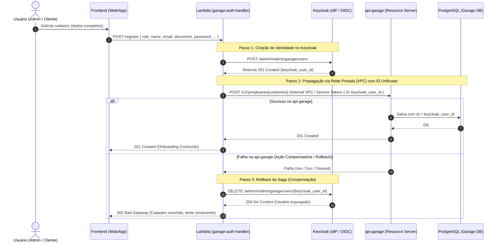

# ADR 0002: Orquestração Centralizada no Backend com Compensação Saga para Onboarding de Usuários

* **Status**: Aceito (Accepted)
* **Data**: 2026-09-10
* **Autores**: Tech Challenge Garage Team
* **Decisores Técnicos**: Especialistas em Arquitetura de Software e Desenvolvimento Backend

---

## 1. Contexto e Declaração do Problema

No desenho inicial de onboarding de usuários (tanto funcionários quanto clientes), o fluxo dependia de o **Frontend (Web/Mobile)** coordenar duas requisições HTTP sequenciais:
1. Chamada para a função AWS Lambda (`POST /register`) para criar a conta e credenciais no provedor de identidade (Keycloak / OIDC).
2. Chamada subsequente para o Resource Server `api-garage` (`POST /v1/employees` ou `POST /v1/customers`) para cadastrar os dados complementares no catálogo da oficina (PostgreSQL).

### Problemas e Fragilidades Identificados:
* **Anti-Pattern *Smart Client / Client-Side Orchestration***: O cliente front-end conhecia a topologia interna de múltiplos microsserviços e era responsável por costurar identificadores entre eles.
* **Risco Crítico de Falha Parcial (*Partial Failure*)**: Se a primeira requisição sucedesse, mas a conexão do usuário caísse (instabilidade de rede móvel, fechamento de aba, timeout) ou a `api-garage` respondesse com erro `5xx`, o sistema entrava em **estado inconsistente**. O usuário passava a existir no Keycloak (com login e senha válidos), mas **não existia no banco da oficina** (`garage.employee` ou `garage.customer`), quebrando regras de integridade relacional e impedindo o uso de ordens de serviço.
* **Inviabilidade de Rollback no Cliente**: Clientes front-end são ambientes inerentemente instáveis e não confiáveis para executar transações compensatórias de rollback em caso de erro na segunda etapa.

---

## 2. Decisão Arquitetural

Decidimos adotar o padrão **Backend Facade / Backend-For-Frontend (BFF)** na função **AWS Lambda (`garage-auth-handler`)**, implementando o **Padrão Saga Coreografado com Ação Compensatória (Rollback)** síncrono para o processo de onboarding de **Employee** e **Customer**.

### 2.1. Ponto de Entrada Único
O Frontend passa a realizar **uma única requisição HTTP atômica**:
* Endpoint: `POST /register`
* Payload unificado com `role: "EMPLOYEE"` ou `role: "CUSTOMER"`, dados pessoais, documento (CPF/CNPJ), senha e eventuais dependências de catálogo (ex: lista de veículos para clientes).

### 2.2. Etapas da Orquestração Transacional (Saga)
1. **Validação de Documento**: O Lambda valida o CPF ou CNPJ contra o algoritmo oficial do Módulo 11 da Receita Federal.
2. **Passo 1 da Saga (Provisionamento IAM)**: O Lambda cria o usuário no Keycloak via Admin REST API (`POST /admin/realms/garage/users`), obtendo o identificador primário gerado (`keycloak_user_id`).
3. **Passo 2 da Saga (Propagação ao Catálogo da Oficina)**: Com base na `role`, o Lambda dispara imediatamente uma chamada HTTP interna para a `api-garage` (`POST /v1/employees` ou `POST /v1/customers`), enviando o mesmo identificador (`id = keycloak_user_id`), assegurando o padrão de **ID Unificado**.
4. **Passo 3 da Saga (Ação Compensatória em Caso de Falha)**: Se a chamada à `api-garage` falhar por erro HTTP (`>= 400`) ou timeout (`5 segundos`), o Lambda captura a falha e dispara a **compensação**:
   ```
   DELETE /admin/realms/garage/users/{keycloak_user_id}
   ```
   O usuário recém-criado no Keycloak é expurgado, prevenindo dados órfãos. O Lambda retorna `502 Bad Gateway` com payload claro de que a operação foi revertida.
5. **Confirmação de Sucesso**: Se ambas as etapas sucederem, o Lambda responde status `201 Created` consolidado com os dados integrados do IdP e do catálogo.

---

## 3. Diagrama da Decisão (Visão C4 / Sequência)



---

## 4. Consequências

### Positivas (Benefícios):
* **Consistência de Dados Garantida**: Elimina-se o risco de usuários "fantasmas" que existem na camada de autenticação mas não no catálogo de negócio.
* **Simplicidade para Clientes (Frontends)**: A experiência do cliente front-end se torna atômica com uma única chamada de rede, reduzindo tráfego e latência do dispositivo móvel.
* **Identidade Unificada (*Unified Identity*)**: O identificador do Keycloak (`UUID`) passa a ser a chave primária relacional em `garage.employee` e `garage.customer`, dispensando tabelas intermediárias de mapeamento (de-para).
* **Resiliência Controlada**: O cliente HTTP da orquestração possui timeout rigoroso (5 segundos com `AbortSignal`), impedindo travamentos de execução no Lambda.

### Negativas / Trade-offs:
* **Acoplamento Temporal**: O Lambda precisa aguardar a resposta síncrona da `api-garage`. Se a `api-garage` estiver fora do ar, o registro de novos usuários fica temporariamente indisponível.
* **Topologia de Rede**: Exige que a função Lambda esteja conectada na mesma VPC ou tenha rota de rede privada autorizada para acessar o Service da `api-garage` no Kubernetes.

---

## 5. Alternativas Consideradas e Rejeitadas

| Alternativa | Veredito | Motivo da Rejeição |
| :--- | :--- | :--- |
| **1. Manter *Client-Side Orchestration*** | **Rejeitada** | Risco inaceitável de inconsistência transacional (*Partial Failure*) e dependência de estabilidade da rede do dispositivo do usuário. |
| **2. Integração Assíncrona (*Event-Driven* via SQS/SNS)** | **Postergada** | Traria consistência eventual assíncrona. No entanto, no fluxo de onboarding, o usuário ou o administrador precisam de confirmação imediata para poder emitir ordens de serviço ou vincular veículos sem esperar delays de mensageria. |
| **3. Inversão para o Resource Server (`api-garage`) criar no Keycloak** | **Rejeitada** | Violaria o princípio de menor privilégio (*Least Privilege*), forçando o backend de negócio principal a armazenar credenciais de super-administrador do Keycloak. |

---

## 6. Referências e Padrões Aplicados
* **Microservices Patterns** - Chris Richardson (*Saga Pattern & Compensating Transactions*).
* **Enterprise Integration Patterns** - Gregor Hohpe (*BFF / Gateway Aggregation*).
* **OWASP Security Guidelines** - *Fail Securely & Centralized Authentication*.
* Documentação dos Diagramas de Sequência:
  - [`docs/phase3/0-employee-creation.md`](file:///c:/git/fiap/15-soat-tech-challenge-garage/docs/phase3/0-employee-creation.md)
  - [`docs/phase3/1-customer-creation.md`](file:///c:/git/fiap/15-soat-tech-challenge-garage/docs/phase3/1-customer-creation.md)
