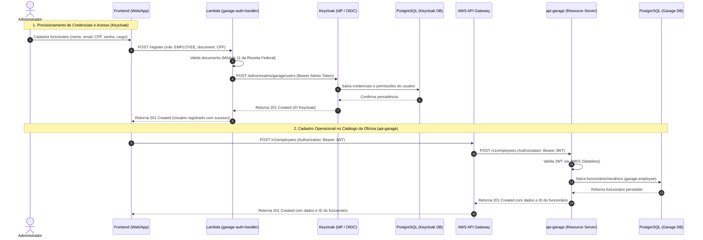

## Diagrama de Sequência

**Cadastro de Funcionários**

```mermaid
sequenceDiagram
    autonumber
    actor admin as Administrador
    participant front as Frontend (Web/App)
    participant lambda as Lambda (garage-auth-handler)
    participant keycloak as Keycloak (IdP / OIDC)
    participant keycloakDb as PostgreSQL (Keycloak DB)
    participant apiGateway as AWS API Gateway
    participant apiGarage as api-garage (Resource Server)
    participant garageDb as PostgreSQL (Garage DB)

    Note over admin,front: 1. Provisionamento de Credenciais e Acesso (Keycloak)
    admin->>front: Cadastra funcionário (nome, email, CPF, senha, cargo)
    front->>lambda: POST /register (role: EMPLOYEE, document: CPF)
    lambda->>lambda: Valida documento (Módulo 11 da Receita Federal)
    lambda->>keycloak: POST /admin/realms/garage/users (Bearer Admin Token)
    keycloak->>keycloakDb: Salva credenciais e permissões do usuário
    keycloakDb-->>keycloak: Confirma persistência
    keycloak-->>lambda: Retorna 201 Created (ID Keycloak)
    lambda-->>front: Retorna 201 Created (Usuário registrado com sucesso)

    Note over admin,garageDb: 2. Cadastro Operacional no Catálogo da Oficina (api-garage)
    front->>apiGateway: POST /v1/employees (Authorization: Bearer JWT)
    apiGateway->>apiGarage: POST /v1/employees (Authorization: Bearer JWT)
    apiGarage->>apiGarage: Valida JWT via JWKS (Stateless)
    apiGarage->>garageDb: Salva funcionário/mecânico (garage.employee)
    garageDb-->>apiGarage: Retorna funcionário persistido
    apiGarage-->>apiGateway: Retorna 201 Created com dados e ID do funcionário
    apiGateway-->>front: Retorna 201 Created com dados e ID do funcionário
```