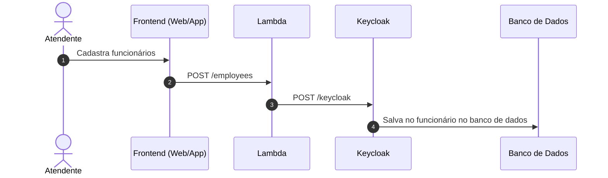

## Diagrama de Sequência

**Cadastro do Cliente**

```mermaid
sequenceDiagram
    autonumber
    actor emp as Atendente
    participant front as Frontend (Web/App)
    participant lambda as Lambda
    participant keycloak as Keycloak
    participant db as Banco de Dados

    emp->>front: Cadastra funcionários
    front->>lambda: POST /employees
    lambda->>keycloak: POST /keycloak
    keycloak->>db: Salva no funcionário no banco de dados
```