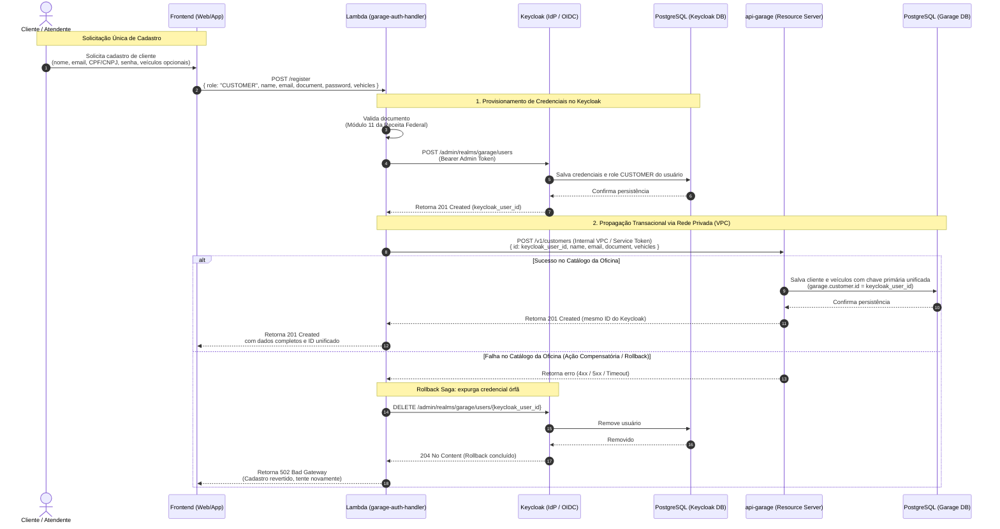

## Diagrama de Sequência

**Cadastro de Cliente (Orquestração no Backend com Compensação Saga)**

```mermaid
sequenceDiagram
    autonumber
    actor user as Cliente / Atendente
    participant front as Frontend (Web/App)
    participant lambda as Lambda (garage-auth-handler)
    participant keycloak as Keycloak (IdP / OIDC)
    participant keycloakDb as PostgreSQL (Keycloak DB)
    participant apiGarage as api-garage (Resource Server)
    participant garageDb as PostgreSQL (Garage DB)

    Note over user,front: Solicitação Única de Cadastro
    user->>front: Solicita cadastro de cliente<br/>(nome, email, CPF/CNPJ, senha, veículos opcionais)
    front->>lambda: POST /register<br/>{ role: "CUSTOMER", name, email, document, password, vehicles }

    Note over lambda,keycloakDb: 1. Provisionamento de Credenciais no Keycloak
    lambda->>lambda: Valida documento<br/>(Módulo 11 da Receita Federal)
    lambda->>keycloak: POST /admin/realms/garage/users<br/>(Bearer Admin Token)
    keycloak->>keycloakDb: Salva credenciais e role CUSTOMER do usuário
    keycloakDb-->>keycloak: Confirma persistência
    keycloak-->>lambda: Retorna 201 Created (keycloak_user_id)

    Note over lambda,garageDb: 2. Propagação Transacional via Rede Privada (VPC)
    lambda->>apiGarage: POST /v1/customers (Internal VPC / Service Token)<br/>{ id: keycloak_user_id, name, email, document, vehicles }

    alt Sucesso no Catálogo da Oficina
        apiGarage->>garageDb: Salva cliente e veículos com chave primária unificada<br/>(garage.customer.id = keycloak_user_id)
        garageDb-->>apiGarage: Confirma persistência
        apiGarage-->>lambda: Retorna 201 Created (mesmo ID do Keycloak)
        lambda-->>front: Retorna 201 Created<br/>com dados completos e ID unificado
    else Falha no Catálogo da Oficina (Ação Compensatória / Rollback)
        apiGarage-->>lambda: Retorna erro (4xx / 5xx / Timeout)
        Note over lambda,keycloak: Rollback Saga: expurga credencial órfã
        lambda->>keycloak: DELETE /admin/realms/garage/users/{keycloak_user_id}
        keycloak->>keycloakDb: Remove usuário
        keycloakDb-->>keycloak: Removido
        keycloak-->>lambda: 204 No Content (Rollback concluído)
        lambda-->>front: Retorna 502 Bad Gateway<br/>(Cadastro revertido, tente novamente)
    end
```

