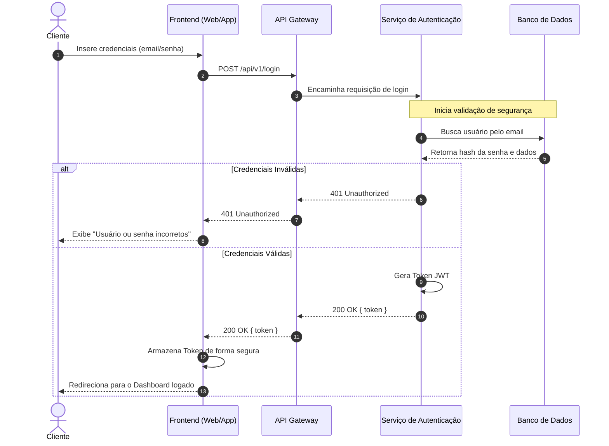

## Diagrama de Sequência

**Criação de Ordem de Serviço**

```mermaid
sequenceDiagram
    autonumber
    actor U as Cliente
    participant F as Frontend (Web/App)
    participant API as API Gateway
    participant Auth as Serviço de Autenticação
    participant BD as Banco de Dados

    U->>F: Insere credenciais (email/senha)
    F->>API: POST /api/v1/login
    API->>Auth: Encaminha requisição de login
    
    Note over Auth,BD: Inicia validação de segurança
    
    Auth->>BD: Busca usuário pelo email
    BD-->>Auth: Retorna hash da senha e dados
    
    alt Credenciais Inválidas
        Auth-->>API: 401 Unauthorized
        API-->>F: 401 Unauthorized
        F-->>U: Exibe "Usuário ou senha incorretos"
    else Credenciais Válidas
        Auth->>Auth: Gera Token JWT
        Auth-->>API: 200 OK { token }
        API-->>F: 200 OK { token }
        F->>F: Armazena Token de forma segura
        F-->>U: Redireciona para o Dashboard logado
    end
```