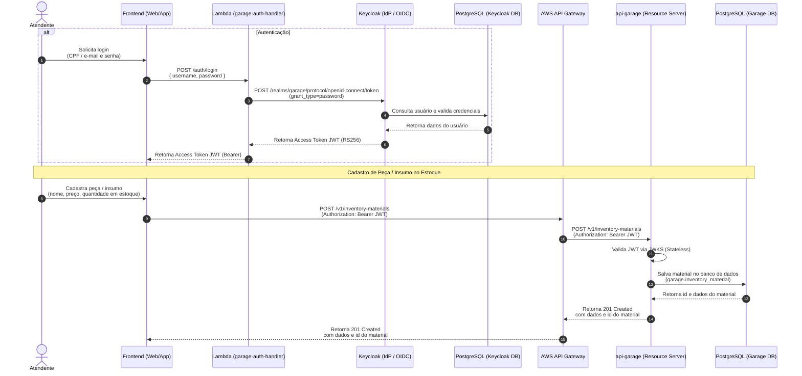

## Diagrama de Sequência

**Cadastro de Material**

```mermaid
sequenceDiagram
    autonumber
    actor emp as Atendente
    participant front as Frontend (Web/App)
    participant lambda as Lambda (garage-auth-handler)
    participant keycloak as Keycloak (IdP / OIDC)
    participant keycloakDb as PostgreSQL (Keycloak DB)
    participant apiGateway as AWS API Gateway
    participant apiGarage as api-garage (Resource Server)
    participant garageDb as PostgreSQL (Garage DB)

    alt Autenticação
        emp->>front: Solicita login<br/>(CPF / e-mail e senha)
        front->>lambda: POST /auth/login<br/>{ username, password }
        lambda->>keycloak: POST /realms/garage/protocol/openid-connect/token<br/>(grant_type=password)
        keycloak->>keycloakDb: Consulta usuário e valida credenciais
        keycloakDb-->>keycloak: Retorna dados do usuário
        keycloak-->>lambda: Retorna Access Token JWT (RS256)
        lambda-->>front: Retorna Access Token JWT (Bearer)
    end

    Note over emp,garageDb: Cadastro de Peça / Insumo no Estoque
    emp->>front: Cadastra peça / insumo<br/>(nome, preço, quantidade em estoque)
    front->>apiGateway: POST /v1/inventory-materials<br/>(Authorization: Bearer JWT)
    apiGateway->>apiGarage: POST /v1/inventory-materials<br/>(Authorization: Bearer JWT)
    apiGarage->>apiGarage: Valida JWT via JWKS (Stateless)
    apiGarage->>garageDb: Salva material no banco de dados<br/>(garage.inventory_material)
    garageDb-->>apiGarage: Retorna id e dados do material
    apiGarage-->>apiGateway: Retorna 201 Created<br/>com dados e id do material
    apiGateway-->>front: Retorna 201 Created<br/>com dados e id do material
```

