## Diagrama de Sequência

**Ciclo de Vida Completo da Ordem de Serviço (Referência: `work_order_lifecycle.feature`)**

Este diagrama documenta o fluxo operacional ponta a ponta implementado nos testes E2E do Cucumber ([`work_order_lifecycle.feature`](file:///C:/git/fiap/15-soat-tech-challenge-garage/e2e/src/test/resources/features/work_order_lifecycle.feature)), cobrindo desde a autenticação, recepção, transições de estado, notificação assíncrona orientada a eventos (SNS/SQS) até o fechamento e cálculo consolidado de métricas operacionais.

```mermaid
sequenceDiagram
    autonumber
    actor op as Operador / Atendente
    participant front as Frontend (Web/App)
    participant lambda as Lambda (garage-auth-handler)
    participant keycloak as Keycloak (IdP / OIDC)
    participant apiGateway as AWS API Gateway
    participant apiGarage as api-garage (Resource Server)
    participant garageDb as PostgreSQL (Garage DB)
    participant sns as AWS SNS (Notification Topic)
    participant sqs as AWS SQS (Notification Queue)

    %% =========================================================================
    %% CONTEXTO: AUTENTICAÇÃO DO OPERADOR
    %% =========================================================================
    Note over op,keycloak: Contexto: Autenticação do Operador via Auth Lambda (SigV4)
    op->>front: Solicita login<br/>(CPF / e-mail e senha)
    front->>lambda: POST /auth/login<br/>{ username, password }
    lambda->>keycloak: POST /realms/garage/protocol/openid-connect/token<br/>(grant_type=password)
    keycloak-->>lambda: Retorna Access Token JWT (RS256)
    lambda-->>front: Retorna Access Token JWT (Bearer)

    %% =========================================================================
    %% ETAPA 1: RECEPÇÃO E ABERTURA (RECEIVED)
    %% =========================================================================
    Note over op,garageDb: 1. Recepção do Veículo e Abertura da OS (Status: RECEIVED)
    op->>front: Cadastra ordem de serviço<br/>(veículo, mecânico responsável, serviços solicitados)
    front->>apiGateway: POST /v1/work-orders<br/>(Authorization: Bearer JWT)
    apiGateway->>apiGarage: POST /v1/work-orders<br/>(Authorization: Bearer JWT)
    apiGarage->>apiGarage: Valida JWT via JWKS (Stateless)
    apiGarage->>garageDb: Valida entidades e salva OS com status RECEIVED<br/>(garage.work_orders)
    garageDb-->>apiGarage: Retorna id e status RECEIVED
    apiGarage-->>apiGateway: Retorna 201 Created com dados da OS
    apiGateway-->>front: Retorna 201 Created (Ordem Aberta)

    %% =========================================================================
    %% ETAPA 2: DIAGNÓSTICO TÉCNICO (DIAGNOSING)
    %% =========================================================================
    Note over op,garageDb: 2. Diagnóstico Técnico pelo Mecânico (Status: DIAGNOSING)
    op->>front: Mecânico inicia diagnóstico da OS
    front->>apiGateway: PUT /v1/work-orders/{id}<br/>{ status: "DIAGNOSING" }
    apiGateway->>apiGarage: PUT /v1/work-orders/{id}<br/>{ status: "DIAGNOSING" }
    apiGarage->>garageDb: Atualiza status da OS para DIAGNOSING
    garageDb-->>apiGarage: Retorna status atualizado
    apiGarage-->>apiGateway: Retorna 200 OK com status DIAGNOSING
    apiGateway-->>front: Retorna 200 OK

    %% =========================================================================
    %% ETAPA 3: CONCLUSÃO DO ORÇAMENTO E NOTIFICAÇÃO (WAITING_FOR_APPROVAL)
    %% =========================================================================
    Note over op,sqs: 3. Conclusão do Orçamento e Notificação Assíncrona (Status: WAITING_FOR_APPROVAL)
    op->>front: Conclui diagnóstico e orça serviços/peças
    front->>apiGateway: PUT /v1/work-orders/{id}<br/>{ status: "WAITING_FOR_APPROVAL" }
    apiGateway->>apiGarage: PUT /v1/work-orders/{id}<br/>{ status: "WAITING_FOR_APPROVAL" }
    apiGarage->>garageDb: Atualiza status para WAITING_FOR_APPROVAL
    garageDb-->>apiGarage: Status atualizado
    apiGarage->>sns: Publica evento de notificação<br/>(Topic: notification-creation_topic)
    sns->>sqs: Fanout com Raw Message Delivery<br/>(Queue: notification-creation_queue)
    apiGarage-->>apiGateway: Retorna 200 OK (Aguardando Aprovação)
    apiGateway-->>front: Retorna 200 OK
    
    sqs-->>apiGarage: @SqsListener consome evento da fila
    apiGarage->>garageDb: Persiste notificação para o cliente<br/>(garage.notifications)
    garageDb-->>apiGarage: Notificação persistida com sucesso

    front->>apiGateway: GET /v1/notifications?externalId={id}
    apiGateway->>apiGarage: GET /v1/notifications?externalId={id}
    apiGarage->>garageDb: Consulta notificação da OS
    garageDb-->>apiGarage: Retorna registro da notificação
    apiGarage-->>apiGateway: Retorna 200 OK com dados da notificação
    apiGateway-->>front: Retorna 200 OK (Notificação Confirmada)

    %% =========================================================================
    %% ETAPA 4: APROVAÇÃO DO CLIENTE E EXECUÇÃO (EXECUTING)
    %% =========================================================================
    Note over op,garageDb: 4. Aprovação do Orçamento e Início dos Reparos (Status: EXECUTING)
    op->>front: Cliente aprova orçamento e execução inicia
    front->>apiGateway: PUT /v1/work-orders/{id}<br/>{ status: "EXECUTING" }
    apiGateway->>apiGarage: PUT /v1/work-orders/{id}<br/>{ status: "EXECUTING" }
    apiGarage->>garageDb: Atualiza status da OS para EXECUTING
    garageDb-->>apiGarage: Retorna status atualizado
    apiGarage-->>apiGateway: Retorna 200 OK com status EXECUTING
    apiGateway-->>front: Retorna 200 OK

    %% =========================================================================
    %% ETAPA 5: CONCLUSÃO DE SERVIÇOS E FINALIZAÇÃO (FINISHED)
    %% =========================================================================
    Note over op,garageDb: 5. Conclusão dos Serviços e Finalização da OS (Status: FINISHED)
    op->>front: Marca serviço individual como concluído
    front->>apiGateway: PATCH /v1/work-orders/{id}<br/>{ finishedServiceId }
    apiGateway->>apiGarage: PATCH /v1/work-orders/{id}<br/>{ finishedServiceId }
    apiGarage->>garageDb: Registra finishedAt no item de serviço
    garageDb-->>apiGarage: Serviço marcado como concluído
    apiGarage-->>apiGateway: Retorna 200 OK com item finalizado
    apiGateway-->>front: Retorna 200 OK

    op->>front: Finaliza a ordem de serviço
    front->>apiGateway: PUT /v1/work-orders/{id}<br/>{ status: "FINISHED" }
    apiGateway->>apiGarage: PUT /v1/work-orders/{id}<br/>{ status: "FINISHED" }
    apiGarage->>garageDb: Atualiza status da OS para FINISHED
    garageDb-->>apiGarage: Retorna status atualizado
    apiGarage-->>apiGateway: Retorna 200 OK com status FINISHED
    apiGateway-->>front: Retorna 200 OK

    %% =========================================================================
    %% ETAPA 6: RETIRADA E LIBERAÇÃO DO VEÍCULO (RELEASED)
    %% =========================================================================
    Note over op,garageDb: 6. Retirada e Liberação do Veículo (Status: RELEASED)
    op->>front: Veículo é entregue e liberado ao cliente
    front->>apiGateway: PUT /v1/work-orders/{id}<br/>{ status: "RELEASED" }
    apiGateway->>apiGarage: PUT /v1/work-orders/{id}<br/>{ status: "RELEASED" }
    apiGarage->>garageDb: Atualiza status da OS para RELEASED
    garageDb-->>apiGarage: Retorna status atualizado
    apiGarage-->>apiGateway: Retorna 200 OK com status RELEASED
    apiGateway-->>front: Retorna 200 OK

    %% =========================================================================
    %% ETAPA 7: CÁLCULO DE MÉTRICAS E TEMPO MÉDIO
    %% =========================================================================
    Note over op,garageDb: 7. Fechamento de Métricas e Cálculo do Tempo Médio de Execução
    op->>front: Aciona rotina de tempo médio de execução
    front->>apiGateway: GET /v1/services/calculateAverageTime
    apiGateway->>apiGarage: GET /v1/services/calculateAverageTime
    apiGarage->>garageDb: Agrupa OSs finalizadas e calcula média dos serviços
    garageDb-->>apiGarage: Persiste averageExecutionTime na tabela de serviços
    apiGarage-->>apiGateway: Retorna 204 No Content
    apiGateway-->>front: Retorna 204 No Content

    front->>apiGateway: GET /v1/services/{serviceId}
    apiGateway->>apiGarage: GET /v1/services/{serviceId}
    apiGarage->>garageDb: Consulta serviço com métricas consolidadas
    garageDb-->>apiGarage: Retorna dados do serviço e averageExecutionTime
    apiGarage-->>apiGateway: Retorna 200 OK com tempo médio persistido
    apiGateway-->>front: Retorna 200 OK (Métricas Verificadas)
```

---

### 📋 Mapeamento de Passos do Gherkin (`work_order_lifecycle.feature`)

| Etapa | Passo Gherkin (`Quando` / `E` / `Então`) | Ação Técnica / Endpoint | Transição de Estado / Efeito |
| :--- | :--- | :--- | :--- |
| **0. Autenticação** | `E que o operador autentica no sistema através do serviço de autenticação` | `POST /auth/login` via Lambda + Keycloak | Emissão de JWT RS256 Bearer |
| **1. Abertura** | `Quando uma nova ordem de serviço é criada para o veículo e mecânico` `Então a ordem de serviço deve ser criada com o status "RECEIVED"` | `POST /v1/work-orders` | Criação com status `RECEIVED` |
| **2. Diagnóstico** | `Quando o mecânico inicia o diagnóstico da ordem de serviço` `Então o status da ordem de serviço deve ser atualizado para "DIAGNOSING"` | `PUT /v1/work-orders/{id}` | Transição para `DIAGNOSING` |
| **3. Orçamento & Notificação** | `Quando o diagnóstico é concluído e aguarda aprovação do cliente` `Então o status da ordem de serviço deve ser atualizado para "WAITING_FOR_APPROVAL"` `E uma notificação deve ser gerada para a ordem de serviço` | `PUT /v1/work-orders/{id}` `GET /v1/notifications?externalId={id}` | Transição para `WAITING_FOR_APPROVAL`, publicação no SNS, consumo pelo SQS e persistência da notificação |
| **4. Aprovação** | `Quando o cliente aprova o orçamento e a execução é iniciada` `Então o status da ordem de serviço deve ser atualizado para "EXECUTING"` | `PUT /v1/work-orders/{id}` | Transição para `EXECUTING` |
| **5. Conclusão** | `Quando o serviço solicitado é marcado como concluído` `E a ordem de serviço é finalizada` `Então o status da ordem de serviço deve ser atualizado para "FINISHED"` | `PATCH /v1/work-orders/{id}` `PUT /v1/work-orders/{id}` | Preenchimento de `finishedAt` e transição para `FINISHED` |
| **6. Liberação** | `Quando o veículo é liberado para o cliente` `Então o status da ordem de serviço deve ser atualizado para "RELEASED"` | `PUT /v1/work-orders/{id}` | Transição para `RELEASED` |
| **7. Métricas** | `Quando a rotina de tempo médio de execução é acionada` `Então o tempo médio do serviço deve ser calculado e persistido` | `GET /v1/services/calculateAverageTime` `GET /v1/services/{id}` | Cálculo consolidado e persistência de `averageExecutionTime` |