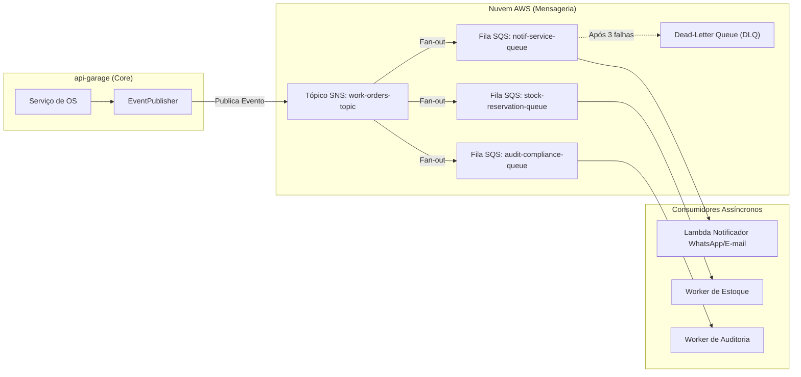

# RFC 0001: Arquitetura Orientada a Eventos (EDA) com AWS SQS/SNS para Ordens de Serviço e Notificações

* **Status**: Em Revisão (In Review)
* **Data de Criação**: 2026-09-10
* **Autor(es)**: Tech Challenge Garage Architecture Guild
* **Alvo de Implementação**: Fase 4 / Evolução do Sistema

---

## 1. Resumo Executivo (Summary)

Propõe-se a evolução da comunicação entre a aplicação central da oficina (`api-garage`) e subsistemas periféricos (como envio de e-mails, notificações WhatsApp/SMS, auditoria e controle de estoque) a partir de uma **Arquitetura Orientada a Eventos (*Event-Driven Architecture - EDA*)**. 

A solução proposta utiliza o padrão **Fan-out com AWS SNS e SQS**: eventos de domínio emitidos na mudança de ciclo de vida das Ordens de Serviço (`WorkOrderCreated`, `WorkOrderApproved`, `WorkOrderFinished`) são publicados em tópicos SNS e consumidos de forma desacoplada por filas SQS dedicadas, com suporte a retentativas automáticas e Dead-Letter Queues (DLQs).

---

## 2. Motivação e Dores Atuais (Motivation)

Atualmente, qualquer ação que ocorra após a atualização de uma Ordem de Serviço (OS) precisa ser executada de forma síncrona dentro da transação HTTP da `api-garage`.

### Dores Críticas:
1. **Acoplamento Temporal e Latência Desnecessária**: Se o serviço de envio de e-mail ou WhatsApp do cliente estiver lento ou indisponível, a resposta do endpoint de finalização da OS demora ou falha para o mecânico.
2. **Violação do Princípio da Responsabilidade Única (SRP)**: O contexto de catálogo/execução da oficina precisa gerenciar integrações com gateways de mensageria externa.
3. **Impossibilidade de Extensibilidade**: Toda nova funcionalidade que precise reagir a uma OS concluída (ex: cálculo de comissão de mecânicos, envio de pesquisa NPS, baixa contábil) exige modificar o código central da API.

---

## 3. Proposta de Design Detalhada (Detailed Design)

### 3.1. Topologia com Padrão SNS Fan-out para Filas SQS



### 3.2. Estrutura do Envelope de Evento de Domínio (CloudEvents Specification)
Adotaremos a especificação padrão **CloudEvents** em JSON:

```json
{
  "specversion": "1.0",
  "type": "br.com.fiap.garage.workorder.finished",
  "source": "/api-garage/v1/work-orders",
  "id": "c623d242-4f17-48f0-b8d9-a034928e469c",
  "time": "2026-09-10T22:30:00Z",
  "datacontenttype": "application/json",
  "data": {
    "workOrderId": "f12c8b9d-5a82-416a-8b89-1090fa77bc32",
    "customerId": "36c9df52-01eb-4ffd-a0c1-1494440aedef",
    "employeeId": "7a403fc9-3c96-408c-984f-1fea2729b59f",
    "vehiclePlate": "ABC1234",
    "totalAmount": 1450.00,
    "status": "FINISHED"
  }
}
```

### 3.3. Garantias de Resiliência
* **Filas SQS com Visibilidade Configurável**: Tempo de visibilidade de 30 segundos para permitir o processamento.
* **Dead-Letter Queue (DLQ)**: Mensagens com erro persistente após 3 tentativas de entrega são isoladas na DLQ para análise sem travar a esteira de eventos.
* **Consumidores Idempotentes**: Cada consumidor verifica se o `id` do evento já foi processado antes de executar a ação (garantindo segurança contra entregas duplicadas *At-Least-Once*).

---

## 4. Desvantagens e Trade-offs (Drawbacks)

* **Consistência Eventual**: O envio da notificação ao cliente ou a baixa de estoque ocorrerá frações de segundo após a transação HTTP da API.
* **Complexidade Operacional**: Adiciona novos recursos gerenciados na AWS (SNS, SQS, IAM Policies, DLQs) que devem ser versionados via Terraform.
* **Observabilidade Distribuída**: Exige rastreamento distribuído (Distributed Tracing via OpenTelemetry / AWS X-Ray) com propagação de `traceparent` no cabeçalho dos eventos.

---

## 5. Alternativas Descartadas (Prior Art / Alternatives)

1. **Apache Kafka / AWS MSK**: Excelente para streams de alto throughput e retenção longa, mas considerado superdimensionado (*over-engineering*) para a volumetria atual da oficina mecânica, trazendo custo de instâncias elevado.
2. **RabbitMQ no Kubernetes**: Exigiria manutenção de pods de cluster stateful com storage persistente (PVs) pela equipe de engenharia. SNS/SQS é 100% serverless, cobrado por uso e livre de manutenção de servidores.

---

## 6. Questões em Aberto (Unresolved Questions)

* Devemos usar o padrão **Transactional Outbox** (ver RFC 0002) para evitar a perda de eventos em caso de queda da aplicação logo após o commit do banco?
* As mensagens devem ser tratadas em ordem estrita (SQS FIFO) ou a ordem padrão com idempotência é suficiente?
