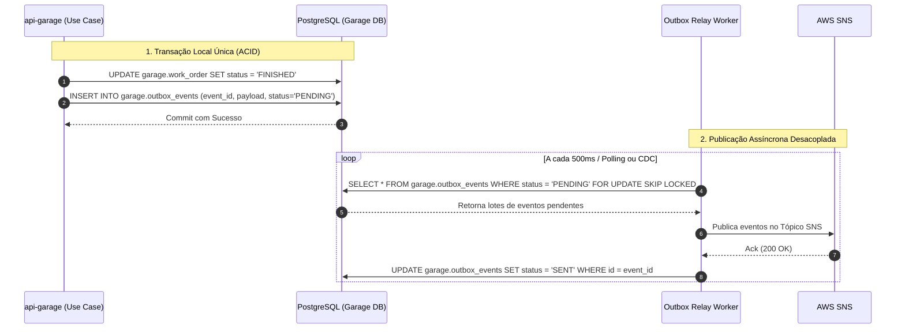

# RFC 0002: Padrão Outbox Transacional (Transactional Outbox) para Garantia de Entrega de Eventos

* **Status**: Proposta (Draft)
* **Data de Criação**: 2026-09-10
* **Autor(es)**: Tech Challenge Garage Architecture Guild
* **Alvo de Implementação**: Fase 4 / Evolução de Mensageria

---

## 1. Resumo Executivo (Summary)

Esta RFC propõe a adoção do padrão **Transactional Outbox Pattern** na aplicação `api-garage`. O padrão resolve o problema clássico de *Dual-Write* em sistemas distribuídos, garantindo que a persistência das alterações de negócio no banco relacional (PostgreSQL) e a publicação do respectivo evento de domínio (SNS/SQS) ocorram com **garantia estrita de entrega *At-Least-Once*** sem risco de perda de mensagens.

---

## 2. Motivação e o Problema do *Dual-Write* (Motivation)

Quando uma aplicação precisa atualizar uma tabela de banco e simultaneamente postar uma mensagem em uma fila ou broker:

```java
// Código ingênuo (Anti-Pattern do Dual-Write):
@Transactional
public void finishWorkOrder(UUID id) {
    workOrderRepository.updateStatus(id, FINISHED); // 1. Grava no DB
    snsPublisher.publish("work-order-finished", event); // 2. Publica no SNS
}
```

### Cenários Catastróficos de Falha:
1. **Falha 1**: Se a chamada ao SNS falhar (timeout de rede ou broker instável), a transação do banco sofre rollback. O mecânico não consegue finalizar a OS por um problema transitório de mensageria.
2. **Falha 2**: Se o banco comitar com sucesso, mas o servidor cair (OOM, reinicialização do pod) antes de chamar o broker, a OS é alterada no banco de dados, mas **o evento nunca é publicado**. O cliente nunca recebe a notificação nem a cobrança.

---

## 3. Proposta de Design Detalhada (Detailed Design)

### 3.1. Arquitetura da Solução

Em vez de publicar diretamente no SNS na mesma transação de negócio:
1. A aplicação grava a Ordem de Serviço na tabela `garage.work_order` e, **na mesma transação ACID do PostgreSQL**, insere um registro na tabela `garage.outbox_events`.
2. Um processo assíncrono em background (*Outbox Relay Worker* com Spring `@Scheduled` ou Debezium CDC) lê os eventos não processados e os publica no SNS.
3. Após a confirmação de recebimento do SNS (HTTP 200), o registro da tabela outbox é marcado como enviado (`status = 'SENT'`) ou removido.



### 3.2. Esquema DDL Sugerido

```sql
CREATE TABLE garage.outbox_events (
    id UUID PRIMARY KEY,
    aggregate_type VARCHAR(64) NOT NULL,
    aggregate_id VARCHAR(64) NOT NULL,
    event_type VARCHAR(128) NOT NULL,
    payload JSONB NOT NULL,
    status VARCHAR(20) NOT NULL DEFAULT 'PENDING',
    created_at TIMESTAMP WITH TIME ZONE DEFAULT CURRENT_TIMESTAMP,
    processed_at TIMESTAMP WITH TIME ZONE
);

CREATE INDEX idx_outbox_pending ON garage.outbox_events (status, created_at) WHERE status = 'PENDING';
```

---

## 4. Desvantagens e Trade-offs (Drawbacks)

* **Volume de Escrita no Banco**: Toda mutação gera dois inserts/updates no PostgreSQL. Mitigado por rotinas de expurgo (particionamento ou job de limpeza periódica de eventos antigos já entregues).
* **Duplicação Potencial**: Em caso de queda do Relay logo após o envio ao SNS mas antes do update no banco, a mensagem pode ser republicada. Portanto, **todos os consumidores devem ser idempotentes**.

---

## 5. Alternativas Consideradas

* **Two-Phase Commit (2PC / XA)**: Protocolo pesado e bloqueante, considerado inviável para aplicações modernas nativas em nuvem.
* **CDC Nativo com Debezium + Kafka Connect**: Solução corporativa robusta, mas que requer infraestrutura adicional considerável. O *Outbox Polling com SKIP LOCKED* atende com excelência a escala atual.
