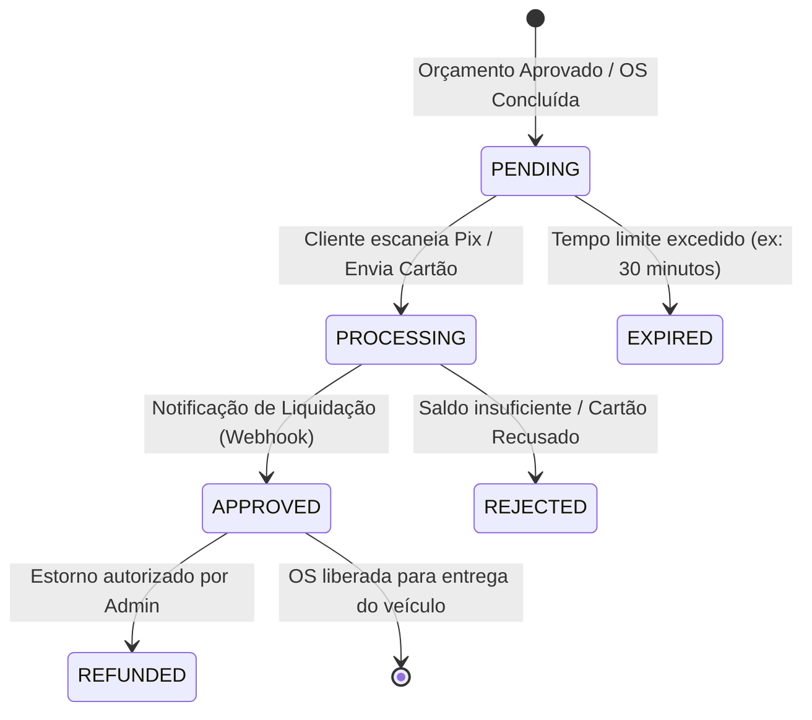
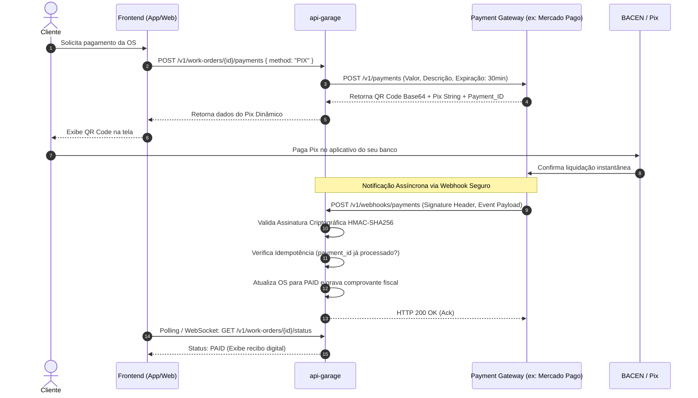

# RFC 0003: Integração com Gateway de Pagamentos e Pix Dinâmico com Webhooks Idempotentes

* **Status**: Proposta (Draft)
* **Data de Criação**: 2026-09-10
* **Autor(es)**: Tech Challenge Garage Architecture Guild
* **Alvo de Implementação**: Fase 4 / Módulo Financeiro

---

## 1. Resumo Executivo (Summary)

Propõe-se a implementação do **Módulo de Pagamentos e Faturamento Automotivo**, permitindo a geração de cobranças instantâneas via **Pix Dinâmico (QR Code e Copia-e-Cola com expiração)** e cartão de crédito para Ordens de Serviço finalizadas ou orçamentos aprovados. A conciliação de pagamento será realizada através do consumo de **Webhooks Idempotentes e Assinados** enviados pelo gateway financeiro (ex: Mercado Pago / Asaas / Stripe).

---

## 2. Motivação e Dores de Negócio (Motivation)

Atualmente, o processo de faturamento da oficina mecânica ocorre de forma manual: o atendente recebe o dinheiro ou maquininha física e não há fechamento automatizado e seguro de ordens de serviço vinculado a comprovantes digitais.

### Objetivos:
1. Permitir que o cliente pague a OS diretamente pelo App/Web via Pix Dinâmico antes de retirar o veículo.
2. Atualizar o status da OS automaticamente para `PAID` (Paga) assim que o Banco Central liquidar o Pix.
3. Garantir imunidade contra ataques de *Replay* e duplicação de pagamentos via Webhook.

---

## 3. Proposta de Design Detalhada (Detailed Design)

### 3.1. Ciclo de Vida do Pagamento (Máquina de Estados)

### 3.2. Fluxo de Geração e Confirmação via Webhook

### 3.3. Mecanismos de Segurança Obrigatórios
1. **Validação de Assinatura HMAC**: Cada webhook recebido possui um header (ex: `X-Signature: sha256=...`) assinado com o secret do gateway. A `api-garage` recalcula o hash do payload cru; requisições sem assinatura válida são rejeitadas com `HTTP 401 Unauthorized`.
2. **Controle de Idempotência**: Tabela `garage.processed_webhooks` com índice único no `event_id` ou `payment_id` para ignorar webhooks reenviados por retry.

---

## 4. Desvantagens e Trade-offs

* Dependência de credenciais e sandbox de gateway de pagamento para rodar a suíte de testes.
* Custos de taxa por transação (MDR) cobrados pelo intermediador financeiro.

---

## 5. Questões em Aberto

* Qual provedor financeiro utilizar no Tech Challenge? (Mercado Pago possui sandbox público e SDK Java amigável).
